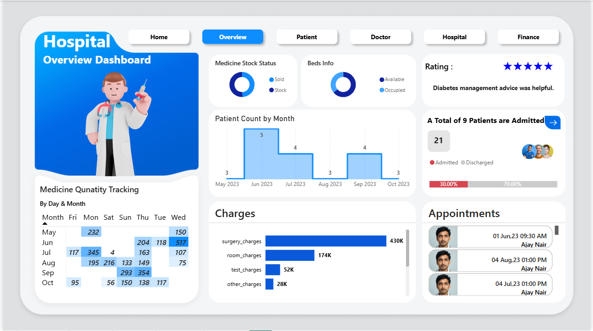
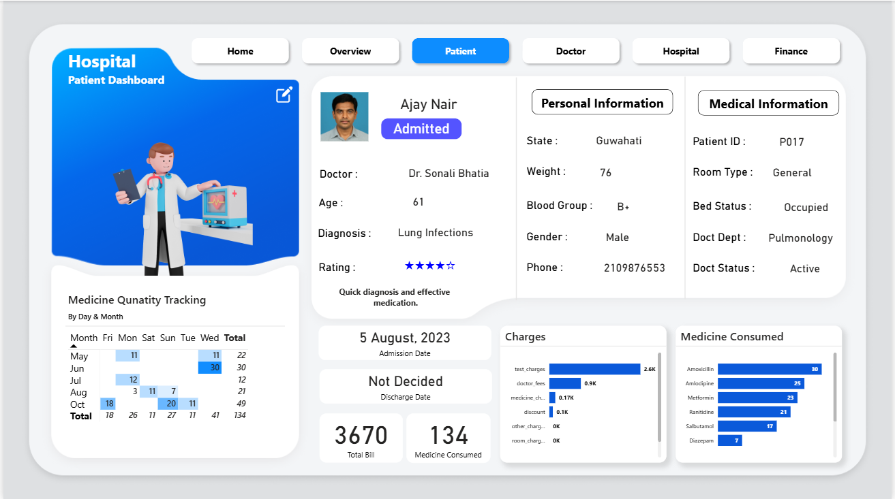
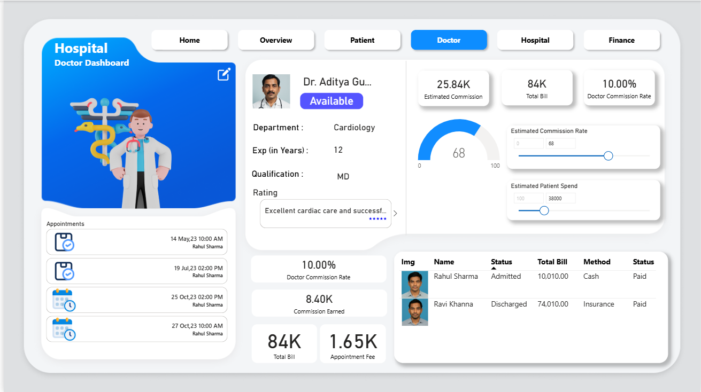
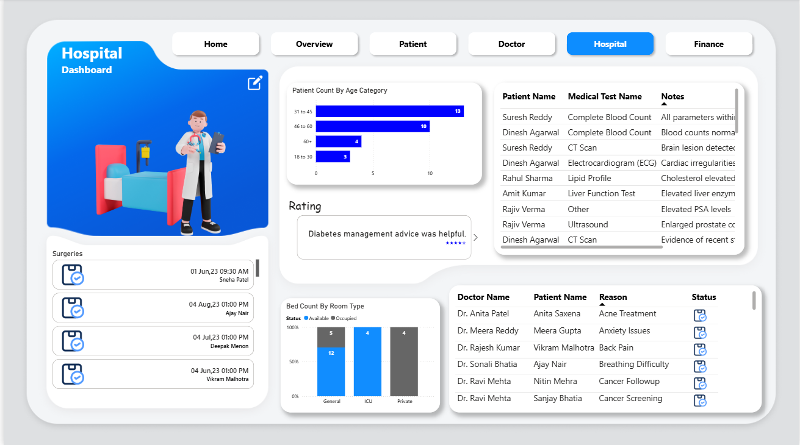
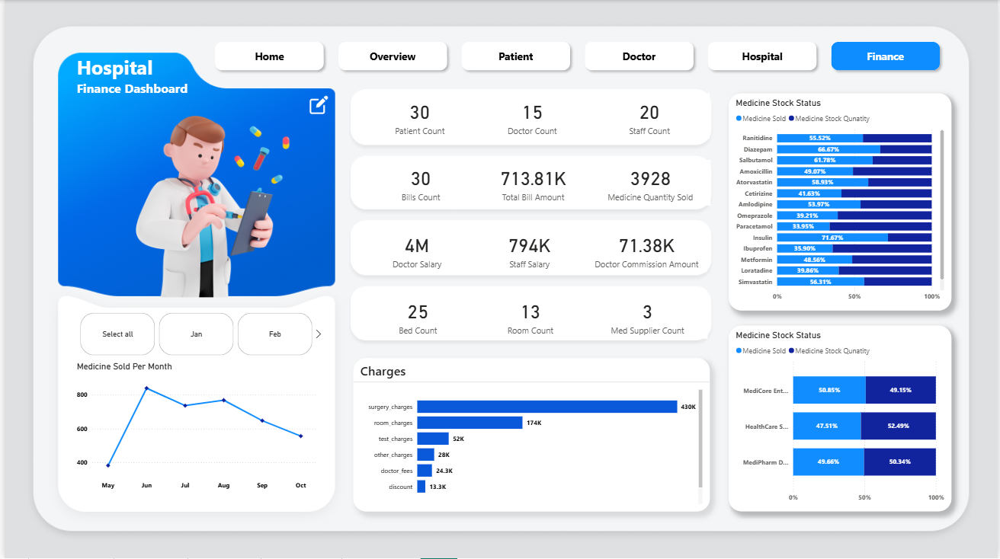

## Hospital Management Dashboard - Power BI

# 🏥 Overview
Hospitals generate large amounts of data – patients, doctors, staff, inventory, and finances. Often, this data is stored but not **utilized** to its full potential.  
This project transforms raw hospital data into **actionable insights** using an interactive **Power BI Dashboard**, telling a complete data-driven story for hospital management.

# ✨ Key Features
- **Multi-Page Dashboard**:
  1. **Overview Page** – KPIs, bed availability, upcoming appointments, stock life, and calendar view.
  2. **Patient Page** – Patient selection with dynamic ratings, personal details, and appointment history.
  3. **Doctor Page** – Doctor profiles, ratings, appointment lists, and commission calculator.
  4. **Hospital Page** – Bed status (General, Private, ICU), patient age distribution, and test availability.
  5. **Finance Page** – Revenue KPIs, expenses, stock consumption, and payment status.
  
- **Dynamic Filtering** – Select patients or doctors to update all relevant visuals instantly.
- **Data Modeling** – Optimized relationships, reduced complexity by merging multiple tables.
- **Data Source Support** – Built with ready to use **Excel** files.

# 🛠 Tools & Technologies
- **Power BI Desktop**
- **Excel** (CSV/Workbook as dataset)
- **MySQL** (Alternative database source)
- **Power Query** for ETL (Extract, Transform, Load)
- **Data Modeling** for optimized relationships

# 📖 Development Process
This dashboard was developed by following a **step-by-step structured process**:
1. **Importing Data**  
   - Directly import **Excel** Files.

2. **Data Transformation**  
   - Cleaned, merged, and reduced tables (from 16+ to minimal)  
   - Added calculated columns (e.g., Admission Status)  
   - Removed duplicates and optimized structure

3. **Data Modeling**  
   - Identified **master table** (`Patient`) as model anchor  
   - Created `One-to-Many` relationships for clear filter flow  
   - Reduced complexity by integrating Doctor, Surgery, Bills, and Department info directly into Patient table

4. **Visualization**  
   - KPIs, charts, slicers, calendars, and rating visuals  
   - Interactive navigation across multiple report pages  
   - Commission calculator for doctors

# 🚀 How to Use
1. Download `Hospital_Management_Dashboard.pbit`.
2. Open it in [Power BI Desktop](https://powerbi.microsoft.com/desktop/).
3. Connect to your dataset.
4. Enjoy interactive exploration of hospital data.

# 📸 Screenshots

# 💡 Learning Outcomes
From this project, you will learn:
- Professional Power Query transformations
- Complex data modeling strategies
- Creating interactive, business-ready dashboards

# 🚀 Live Demo
🔗 **[View Dashboard in Power BI Service](PASTE_YOUR_SHAREABLE_LINK_HERE)**
